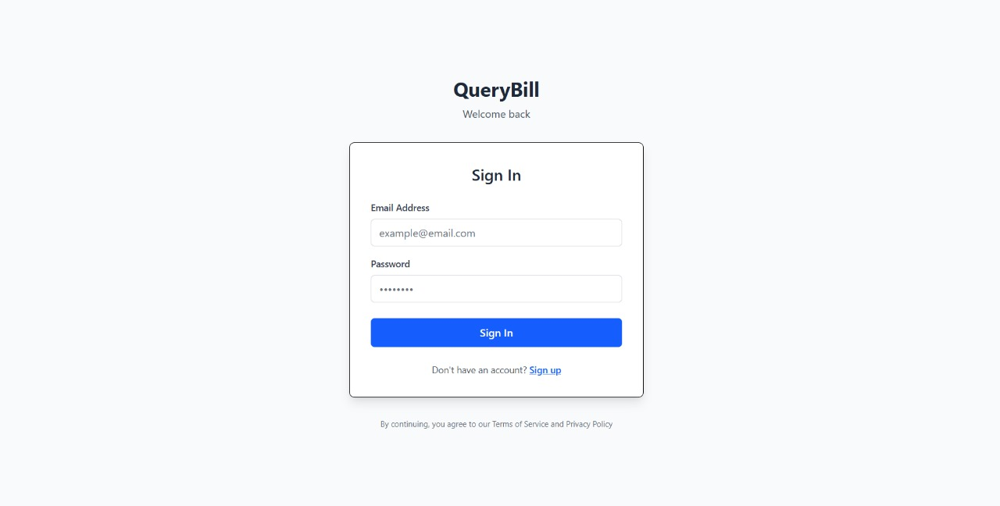
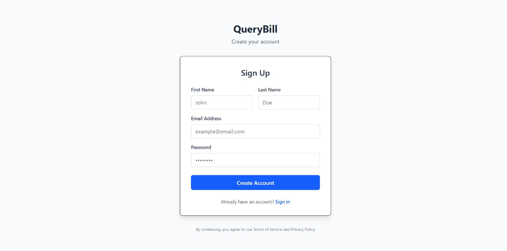
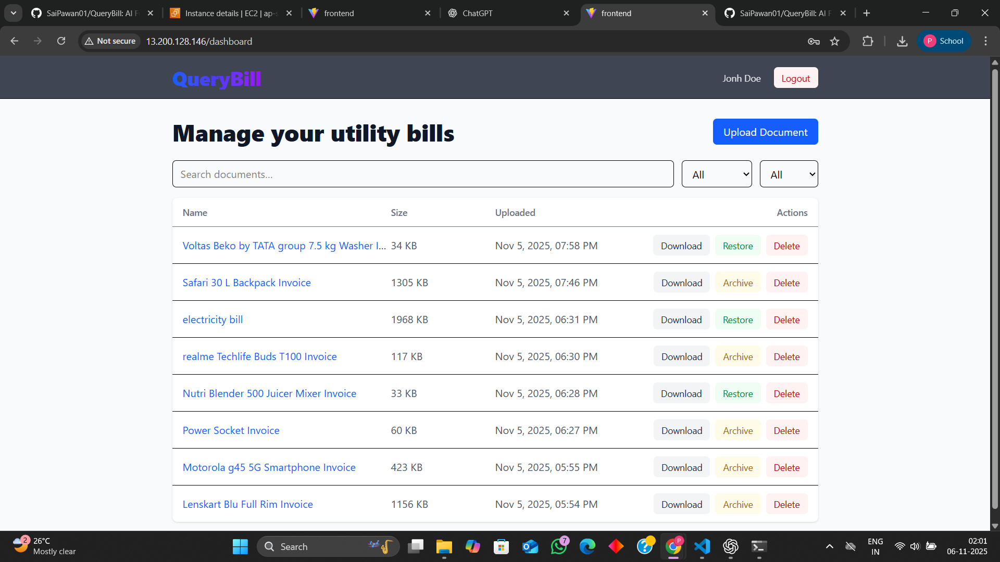

# 🧠 AI Full-Stack App for Structured Data Extraction and Interactive Q&A Chat

An end-to-end AI-powered web application that extracts structured data from utility bills and receipts (PDF/Image) and enables interactive Q&A with the extracted information via an AI chat interface.
Built using **React, FastAPI, PostgreSQL**, and **LangChain/LangGraph** with full Docker support.

## 🌐 Links

**Application Link:** [http://13.233.102.26/](http://13.233.102.26/)

**API Documentation:** [http://13.233.102.26/docs](http://13.233.102.26:8000/docs)


## 🧩 Architecture


| Layer              | Technologies                                  |
| -------------------- | ----------------------------------------------- |
| **Frontend**       | React.js, Redux, Tailwind CSS                 |
| **Backend**        | Python, FastAPI, REST API, JWT Authentication |
| **Database**       | PostgreSQL (Supabase deployment) |
| **AI Layer**       | LangChain / Gemini                            |
| **Authentication** | JWT, bcrypt                                   |
| **Deployment**     | Docker, Docker Compose, AWS EC2               |

## 📁 Project Structure

<pre class="overflow-visible!" data-start="240" data-end="2376"><div class="contain-inline-size rounded-2xl relative bg-token-sidebar-surface-primary"><div class="sticky top-9"><div class="absolute end-0 bottom-0 flex h-9 items-center pe-2"><div class="bg-token-bg-elevated-secondary text-token-text-secondary flex items-center gap-4 rounded-sm px-2 font-sans text-xs"></div></div></div><div class="overflow-y-auto p-4" dir="ltr"><code class="whitespace-pre! language-bash"><span><span>QueryBill/
│
├── backend/
│   ├── .venv/                      </span><span><span class="hljs-comment"># Python virtual environment (ignored in Git)</span></span><span>
│   ├── app/
│   │   ├── auth/                   </span><span><span class="hljs-comment"># Authentication routes & logic</span></span><span>
│   │   ├── models/                 </span><span><span class="hljs-comment"># Database models (Pydantic / SQLAlchemy)</span></span><span>
│   │   ├── routes/                 </span><span><span class="hljs-comment"># API route definitions</span></span><span>
│   │   ├── schemas/                </span><span><span class="hljs-comment"># Pydantic schemas for request/response models</span></span><span>
│   │   ├── services/               </span><span><span class="hljs-comment"># Reusable backend business logic</span></span><span>
│   │   ├── database.py             </span><span><span class="hljs-comment"># Database connection configuration</span></span><span>
│   │   ├── main.py                 </span><span><span class="hljs-comment"># FastAPI application entry point</span></span><span>
│   │   └── __init__.py
│   │
│   ├── uploads/                    </span><span><span class="hljs-comment"># Directory for uploaded files</span></span><span>
│   ├── .</span><span><span class="hljs-built_in">env</span></span><span>                        </span><span><span class="hljs-comment"># Environment variables for backend</span></span><span>
│   ├── .gitignore
│   ├── Dockerfile                  </span><span><span class="hljs-comment"># Docker configuration for backend</span></span><span>
│   └── requirements.txt            </span><span><span class="hljs-comment"># Python dependencies</span></span><span>
│
├── frontend/
│   ├── dist/                       </span><span><span class="hljs-comment"># Production build output (generated by Vite)</span></span><span>
│   ├── node_modules/               </span><span><span class="hljs-comment"># Node.js dependencies</span></span><span>
│   ├── public/
│   │   └── vite.svg
│   ├── src/                        </span><span><span class="hljs-comment"># React components and logic</span></span><span>
│   ├── .</span><span><span class="hljs-built_in">env</span></span><span>                        </span><span><span class="hljs-comment"># Environment variables for frontend (VITE_API_URL)</span></span><span>
│   ├── .gitignore
│   ├── Dockerfile                  </span><span><span class="hljs-comment"># Docker configuration for frontend</span></span><span>
│   ├── eslint.config.js
│   ├── index.html
│   ├── nginx.conf                  </span><span><span class="hljs-comment"># Nginx configuration for serving frontend + API proxy</span></span><span>
│   ├── package.json                </span><span><span class="hljs-comment"># Frontend dependencies and scripts</span></span><span>
│   ├── package-lock.json
│   ├── vite.config.js              </span><span><span class="hljs-comment"># Vite build configuration</span></span><span>
│   └── README.md                   </span><span><span class="hljs-comment"># Frontend-specific README (optional)</span></span><span>
│
│
├── docker-compose.yaml             </span><span><span class="hljs-comment"># Docker Compose setup (Frontend + Backend)</span></span><span>
└── README.md                       </span><span><span class="hljs-comment"># Main project documentation</span></span></span></code></div></div></pre>

## 🧱 Development Process

### 1. **Requirement Analysis**

- Identified the need for automated data extraction from utility bills and receipts.
- Designed modular architecture supporting AI integration and scalable APIs.

### 2. **Frontend Development**

- Built with React and Redux for state management.
- Developed a **dashboard page** to upload and manage the documents.
- Developed a **three-panel layout**:

  - **Left Panel:** Document Viewer with zoom/pan and multi-page support.
  - **Middle Panel:** Structured Data Editor for extracted information.
  - **Right Panel:** AI Chat Interface for Q&A.

### 3. **Backend Development**

- Implemented **FastAPI** REST APIs with JWT authentication.
- Integrated **LangChain** for AI-powered text extraction and Q&A.
- Used **PostgreSQL** to manage user, document, and chat history data.
- Created routes for uploading documents, retrieving extracted data, and handling chat queries.

### 4. **AI Integration**

- Implemented **OCR-based extraction pipelines using EasyOCR** extract raw text from utility bills and receipts (PDF/Image).
- Passed the extracted text to **Gemini LLM** for intelligent **structured data extraction** into JSON format.
- Parsed and organized the JSON output into key-value pairs for essential fields such as **invoice number, customer name, dates, total amount**, etc.
- Built **Q&A logic** that references the extracted JSON fields for context-aware conversational responses.

### 5. **Containerization & Deployment**

- Created **Dockerfiles** for frontend and backend.
- Configured **docker-compose.yml** for local and cloud orchestration.
- Deployed the app to **AWS EC2** with proper environment variables.
- Hosted the database in Supabase by running sql schema scripts"

---

## ⚙️ Challenges Faced and Solutions


| Challenge      | Solution       |
| ---------------- | ---------------- |
| Faced CORS error | Configured FastAPI `CORSMiddleware` with allowed origins and updated frontend API URL. |
| Database migration | Hosted the database on Supabase and executed the SQL schema script for quick setup. |
| Pytesseract import error | Switched to EasyOCR for smoother text extraction without dependency issues. |
| No standard schema for utility bills | Designed a detailed utility bill schema to capture all essential information. |
| Python dependency conflicts | Resolved by installing correct dependency versions and specifying them in `requirements.txt`. |
| Document upload functionality timed out | Increased request timeout limits in `nginx.conf`|
| Database schema export error in pgAdmin | Resolved by taking a backup of the database without including data. |


## 📸 Screenshots

### 🟦 **Login Page**



### 🟩 **Sign-Up Page**



### 🧾 **Dashboard**



### 🪟 **Three-Panel Layout**


## ⚙️ Setup & Installation

##### Clone Repository

clone the repository

```bash
git clone https://github.com/SaiPawan01/QueryBill.git
cd QueryBill
```

##### Envirnoment Variables

Create a .env file in both frontend and backend folders.

###### 🖥️ Frontend (.env)

```bash
VITE_API_URL=http://<your-ec2-ip>
```

###### ⚙️ Backend (.env)

```bash
# Allowed Origins
ALLOWED_ORIGINS=http://localhost:5173

# Database Configuration
SQLALCHEMY_DATABASE_URL=postgresql+psycopg2://postgres:password@db:5432/querybill

# JWT Authentication
JWT_SECRET_KEY=your_jwt_secret_key
JWT_ALGORITHM=HS256
ACCESS_TOKEN_EXPIRE_MINUTES=60

# AI Keys
GEMINI_API_KEY=your_gemini_api_key

```

##### Run Without Docker (Manual Setup)

If you prefer to run the project locally without Docker:

###### 🖥️ Backend Setup

cd backend
python -m venv .venv
.venv/Scripts/activate    # ( on Windows)
pip install -r requirements.txt

uvicorn app.main:app --reload

###### 💻 Frontend Setup

```bash
cd frontend
npm install
npm run dev
```

##### 🚀Access the app locally:

```bash
Frontend → http://localhost:5173
Backend → http://localhost:8000/docs
```
